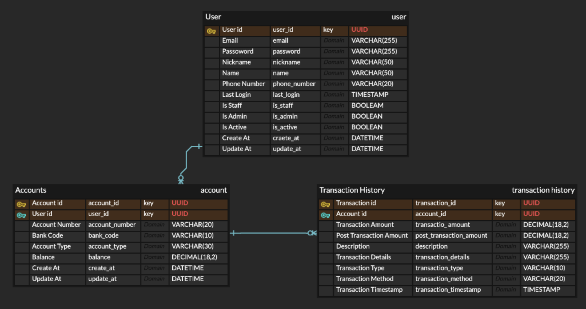
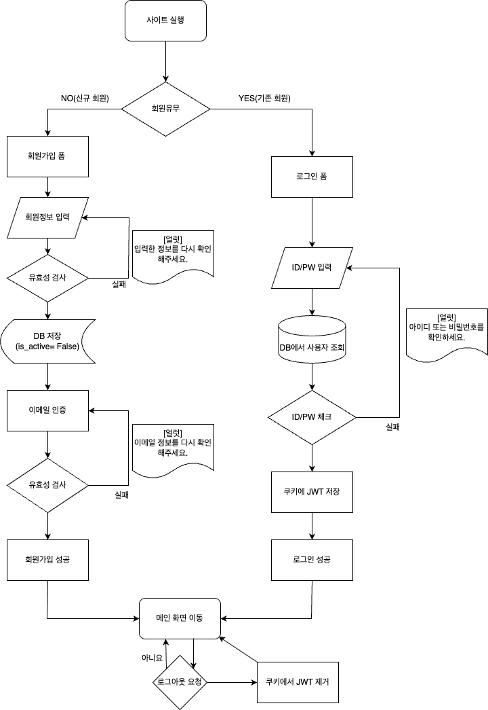

## ERD Screenshot



## 'Users' 테이블
 - 사용자 계정 정보를 저장하는 테이블

| 필드명          | 타입           | 설명                     |
|--------------|--------------|--------------------------|
| user_id      | UUID         | 기본 키, 사용자 식별자      |
| email        | VARCHAR(255) | 이메일, 로그인 ID (유니크)   |
| password     | VARCHAR(255) | 비밀번호                  |
| nickname     | VARCHAR(50)  | 닉네임 (유니크)           |
| name         | VARCHAR(50)  | 실명                     |
| phone_number | VARCHAR(20)  | 전화번호                  |
| last_login   | DATETIME     | 마지막 로그인 일시          |
| is_staff     | BOOLEAN      | 스태프 권한 여부            |
| is_admin     | BOOLEAN      | 관리자 권한 여부            |
| is_active    | BOOLEAN      | 계정 활성화 여부            |
| created_at   | DATETIME     | 계정 생성일                |
| updated_at   | DATETIME     | 계정 정보 수정일            |


## 'Accounts' 테이블
 - 사용자가 보유한 계좌 정보를 저장하는 테이블

| 필드명            | 타입            | 설명                          |
|----------------|---------------|-----------------------------|
| account_id     | UUID          | 기본 키, 계좌 식별자                |
| user_id        | UUID          | `users` 테이블의 외래키, 계좌 소유자 식별 |
| account_number | VARCHAR(20)   | 계좌번호 (유니크)                  |
| bank_code      | VARCHAR(10)   | 은행 코드 (카카오뱅크, KB, NH 등)     |
| account_type   | VARCHAR(30)   | 계좌 종류 (입출금, 마이너스 등)         |
| balance        | DECIMAL(18,2) | 현재 잔액                       |
| created_at     | DATETIME      | 계좌 생성일                      |
| update_at      | DATETIME      | 계좌 정보 수정일                   |


## 'Transaction History' 테이블
 - 계좌의 거래 내역을 저장하는 테이블

| 필드명                   | 타입            | 설명                                              |
|-----------------------|---------------|---------------------------------------------------|
| transaction_id        | UUID          | 기본 키, 거래 식별자                                   |
| account_id            | UUID          | `accounts` 테이블의 외래키, 거래가 발생한 계좌 식별자         |
| transtacion_amount    | DECIMAL(18,2) | 거래 금액                                           |
| balance               | DECIMAL(18,2) | 거래 이후 잔액                                       |
| description           | VARCHAR(255)  | 거래 상세 내역 (예: 올리브영, ATM 출금 등)                  |
| transaction_details   | VARCHAR(255)  | 입출금 타입 (`입금`, `출금`)                            |
| transaction_type      | VARCHAR(10)   | 입출금 타입 (`입금`, `출금`)                            |
| transaction_method    | VARCHAR(20)   | 거래 방식 (`현금`, `이체`, `자동이체`, `카드결제` 등)         |
| transaction_timestamp | TIMESTAMP     | 거래 일시                                           |


## 테이블 간의 관계

### **Users ↔ Accounts**
 - 관계 : **1 : N**
 - (한 명의 유저가 여러 계좌를 가질 수 있음.)
 - 'accounts.user_id' 는 'users.id'를 참조

### **Accounts ↔ Transaction History**
 - 관계 : **1 : N**
 - (하나의 계좌에 여러 거래 내역이 생길 수 있음.)
 - 'transaction_history.account_id' 는 'accounts.id'를 참조


## 회원가입 로그인 플로우차트



아래는 위 플로우차트에 대응하는 로직 설명입니다.

```text
1. 회원가입 또는 로그인 선택
2. [회원가입]
   1) 회원가입 폼 표시
   2) 회원정보 입력
   3) 유효성 검사
      - 불합격 → 팝업("입력 정보 확인") → 정보 재입력
      - 합격   → DB에 저장(is_active=False) → 인증 메일 발송 → 이메일 인증 → 회원가입 완료 
3. [로그인]
   1) 로그인 폼 표시
   2) ID/PW 입력
   3) DB에서 사용자 조회 및 비밀번호 검증
      - 실패 → 팝업("아이디 또는 비밀번호 확인") → 재입력
      - 성공 → 쿠키에 JWT 저장 → 메인 화면 이동
4. [로그아웃]
   - 메인 화면에서 로그아웃 요청 시 → 쿠키에서 JWT 제거 → End
```